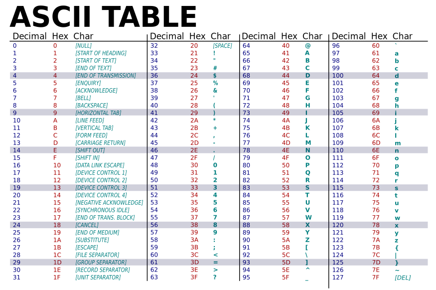

# Appunti di informatica.

*introduzione all'architettura dei microprocessori, all'uso della memoria, agli strumenti di sviluppo '23 Ivan M.*

## Layout della memoria di un programma C

## Un esempio tipico di programma in esecuzione
1. Segmento Text: Contiene le istruzioni del codice in esecuzione. e' generalmente posto piu in basso dei segmenti heap e stack per evitare che questi, aumentando di dimensioni, lo sovrascrivano.
2. Segmento dei dati inizializzati (initialized data): E' una porzione dello spazio del programma che contiene le variabili **globali** e **statiche** che sono inizializzate dal programmatore. Da notare che questo segmento non e' di sola lettura (cioe' contenete sole costanti), infatti puo ulteriormente essere classificato come *inizializzato di sola lettura* oppure *inizializzato di lettura e scrittura* infatti le variabili inizializzate al di fuori del *main* come:  
	`int i = 100;` 
	`char str[] = 'Questa e' la mia stringa";`  
ossia variabili **globali** saranno poste nell'area di **lettura e scrittura** della *initialized data segment.*  Una **costante** invece, come:  
	`const char *s = "Stringa costante";`  
sara' memorizzata nell'area di **sola lettura.**. (Il suo puntatore `*s` sara memorizzato nell'area di lettura scrittura).
3. Segmento dei dati non inizializzati (uninitialized data o bss): Questo segmento inizia subito dopo il segmento dei dati inizializzati e predispone lo spazio per accogliere tutte le variabili  globali statiche inizializzate a zero o non esplicitamente inizializzate nel codice sorgente. Ad esempio una variabile del tipo: "`int i;`" oppure  "`static int j;`" saranno poste nel bss.
4. Segmento dello stack (o pila): Tradizionalmente lo stack e' adiacente allo Heap e "cresce" in direzione opposta a quest'ultimo. Quando lo stack, aumentando di volume incontra lo heap la memoria termina e viene generato un errore di tipo 'stack smashing' (scontro dello stack) o piu comunemente 'segmentation fault' (errore di segmentazione). 
Lo stack e' una coda di tipo LIFO. (Last in first out), tipicamente collocata nella parte alta della memoria dedicata al processo. (un processo e' un programma in esecuzione).
Lo stack accoglie le le operazioni di "stack" del processo. Questo significa che tutte quelle procedure che hanno bisogno o sono particolarmente adatte ad essere modellate usando questo tipo di memorizzazione vengono inserite in quest'area di memoria.
Trattandosi di una LIFO viene mantenuto uno *stack pointer* che tiene traccia dell'ultimo indirizzo utilizzato. Questo puntatore viene incrementato e decrementato a seconda che i dati siano tolti "pull" dallo stack o aggiunti "push" allo stack.
Tipicamente le chiamate a funzione fanno uso dello stack o anche le variabili automatiche (quelle la cui area di validita' e' limitata).
5. lo Heap (mucchio o cumulo): Lo heap e' qule segmento dove la memoria dinamica viene accolta (La memoria dinamica e' quella memoria di cui non se ne conosce l'entita' prima che il programma venga avviato es. l'apertura di un immagine, non si puo sapere a priori quanto grande sara'). Tipicamente esso inizia dopo il bss e cresce verso l'alto. Deve essere esplicitamente richiesto al sistema operativo (funzioni malloc, realloc) e liberato (funzione free) al termine del suo utilizzo.

**size(1)** permette di vedere il layout della memoria di un programma o file oggetto.

## Tipi di dato di C sulle architetture x86-64(e di molti altri linguaggi)

### La tabella dei caratteri ascii:
I caratteri ASCII (pronunciato 'aski') definiscono una codifica standard per la rappresentazione di caratteri (lettere, numeri e segni di punteggiatura) su computer e dispositivi elettronici in generali. Sono molto limitati, infatti sono composti da 127 simboli (rappresentati con 7bit) di cui 95 stampabili (quindi visibili su schermo o altro dispositivo) mentre il resto sono caratteri di controllo. (line feed, carriage return e caratteri per dispositivi di trasmissione dati). Alla base della sual limitazione c'e' l'anzianita. infatti la sua nascita risale al 1963. Anche se inglobati nel piu ampio sistema UNICODE che permette di rappresentare milioni di simboli sono comunque vastamente usati per la loro efficenza nella rappresentazione di dati nella memoria e per le operazioni di programmazione nei dispositivi informatici.

### Impronta nella memoria dei tipi di dato in C
	char:			byte: 1, bits 8
	short: 			byte: 2, bits 16
	int: 			byte: 4, bits 32
	long:			byte: 8, bits 64
	float:			byte: 4, bits 32
	unsigned int:	byte: 4, bits 32
	double:			byte: 8, bits 64

** Ricordarsi di parlare dell' overflow delle variabili **

## Processo di compilazione di un programma

###Automazione con Makefiles

partendo da un programma .c

Il preprocessore si occupa di manipolare le Macro come #define e #include inoltre toglie i commenti
Ad esempio sostituisce le istanze agli headers con il contenuto del file istanziato ingrandendo di parecchio il file .c (copia e incolla).

A questo punto il file risultante viene compilato. in questo passaggio ogni istruzione del programma viene tradotta in linguaggio assembly ottimizzando il codice al meglio per il tipo di architettura del processore sottostante. Viene generato un file con estensione ".S"

Il file .S passa attreverso l'assemblatore che lo traduce in un file oggetto che e'linguaggio macchina ma non e' ancora adatto ad essere eseguito perche mancante di alcune componenti esterne, come le librerie precompilate e i files esterni (tipicamente gli include)
E' un file compilato per una specifica CPU ed uno specifico sistema operativo ma non e' un eseguibile completo. L'estensione tipica e' ".o"

Il file oggetto a questo punto viene passato attraverso il linker che lo collega alle componenti necessarie per renderlo un eseguibile funzionante. Il linker quindi mette assieme tutti i file oggetto richiesti e produce un eseguibile

Tutti questi passaggi sono ottenibili singolarmente attraverso l'uso di un opzione del compilatore.
(clang ,gcc, ...)

* -E	Output del preprocessor
* -S	Output dell assembler (.S)
* -c 	Output del compilatore come file oggetto (.o)
* 	(per il linker non esiste un opzione. Questa e' di default perche rappresenta il passo finale a completamento di tutto il processo)

es: >gcc myprog.c -S  *Genera un file myprog.s contenente il codice assembly (le sintassi variano leggermente fra opzione e opzione)*

### Le librerie

Codici sorgenti compilati come file oggetto possono essere collegati (linked) assieme per completare e rendere eseguibile il programma. Esempio:

il programma geom.c viene tradotto in file oggetto geom.o, allo stesso modo la libreria gd.c viene tradotta in file oggetto gd.o. L'ultimo passaggio e quello di collegarli (link) per creare l'eseguibile geom.

** In verde i comandi del compilatore *clang* per ottenere il programma eseguibile.

I file di libreria differiscono da un file sorgente primario per la mancanza della funzione speciale `main()` infatti essi contengono solo procedure (o funzioni) di servizio.

Nell'immagine si vede come e' possibile utilizzare la stessa libreria in due programmi diversi geom e tip. Essi necessitano di una stessa funzione presente in gd.c di conseguenza e' possibile riutilizzarla in entrambi i codici. Se si possiede gia il file oggetto gd.o e' possibile uttilizzarlo senza ricompilare gd.c. Questo costituisce un grande risparmio di tempo.

E' utile ricordare che tutte le librerie standard di c/c++ funzionano in questo modo. La direttiva di preprocessore `#include<>` permette di inserire all'inizio del file sorgente i prototipi delle funzioni che corrispondono alle controparti realmente implementate nel file oggetto della rispettiva libreria (es stdio.h, math.h ..etc..)

## Make

Lo strumento di automazione della compilazione del codice Make consente di compilare programmi eseguibili e librerie dal codice sorgente leggendo dei files chiamati *makefiles* che specificano come derivare il programma destinazione attravrso una catena di dipendenze appoggiandosi a interfacce IDE o da console. Make e' vastamente utilizzato nel mondo dello sviluppo software per la sua scalabilita', flessibilita e maturita' .(e' stato creato nel 1976 da Stuart Feldman nei laboratori Bell)

Il formato di Makefile e piuttosto specifico, e' composto da una serie di blocchi o paragrafi, ognuno dei quali e' chiamato *recipe* (ricetta) il formato di una ricetta e' il seguente:

	obbiettivo: dipendenze
		azione
Importante ricordare che azione **deve avere un carattere di tabulazione a sinistra** cioe deve essere indentato. **Gli spazi non sono validi!**

Prendendo in esame gli esempi del paragrafo precedente vediamo come si costruisce l'albero delle dipendenze:

	# -*- Makefile -*-

	geom: geom.o gd.o
		clang geom.o gd.o -o geom

	geom.o geom.c
		clang -c geom.c

	gd.o gd.c
		clang -c gd.c

Nei tre blocchi si nota come per ogni obbiettivo sia dichiarata la dipendenza per poi esprimere il comando necessario ad ottenere l'obbiettivo scritto.

a questo punto digitando il comando

`> make`

si otterra la compilazione in cascata di tutti i files necessari per raggiungere il target finale del file eseguibile nella sequenza:

	clang -c geom.o
	clang -c gd.o
	clang geom.o gd.o -o geom

se `make` viene invocato una seconda volta si ottiene come risultato:

`make: 'geom'  is up to date.`

che ci informa che il codice e' pronto e non e' necessaria una nuova compilazione perche non ci sono state modifiche al codice stesso.

** NB vanno aggiunti anche gli header nel target di tutte le librerie che usano include  es: gd.h nelle dipendenze di geom.o **

###clean

un target utile da avere e' quello che permette la rimozione di tutti i files creati lasciando solo i sorgenti

	clean:
		rm -f *.o geom

utilizzando il comando:

`	> make clean`

si ottiene la cancellazione di tutti i file .o e degli eseguibili.

[Guida di Markdown] (https://www.markdownguide.org).

*Ivan Mella 10/2023.*

